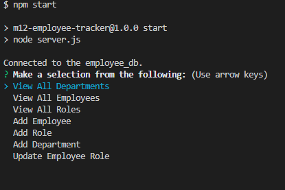

  

  # M12-Employee-Tracker

  ## Description
  Employee Tracker is a command line interface application that takes a user's input to update a database. It was made for practice in mySQL. This project allows the user to view, update, and add employees, roles, and departments. During this project I learned to:
  
  - Utilize mySQL for databases

  - Create, read, update and delete from a database

  - Display tables in the command line interface

  
  ## Table of Contents
  
  1. [Installation](#installation)
  2. [Usage](#usage)
  3. [Contributing](#contributing)
  4. [License](#license)
  5. [Questions](#questions)
  
  ## Installation
  
  1. Clone the repo to your local machine. 
  2. Make sure you have node.js installed.
  3. Make sure you have DBeaver installed. 
  4. Use npm i in the terminal to install the package.
  5. Run the schema, seeds, and query in DBeaver
  
  
(<a href="#readme-top">back to top</a>)

  ## Usage
  
  Open your terminal and run `npm start` in the command line.

  [Screencastify Video Demo](https://drive.google.com/file/d/1yaK_XOBdtUkbO7nEMZZr-_0gqk72Jldg/view)
  
  
  
  Follow the prompts on the screen, navigating the menu with the arrow keys.
 
  ## Contributing
  
  To contribute: 
  1. Fork the repo. 
  2. Make the changes you think would benefit this project
  3. Submit a pull request for review.
  
(<a href="#readme-top">back to top</a>)

  ## License
  Copyright (c) [benjamincottrell](https://github.com/benjamincottrell). All rights reserved. 
  
Licensed under the [MIT license](https://choosealicense.com/licenses/mit/).
  
(<a href="#readme-top">back to top</a>)

  ## Questions
  For any further questions feel free to contact me via:
  - GitHub: [benjamincottrell](https://github.com/benjamincottrell)
  - Email: [bencottrell48@yahoo.com](mailto:bencottrell48@yahoo.com)
  
(<a href="#readme-top">back to top</a>)

